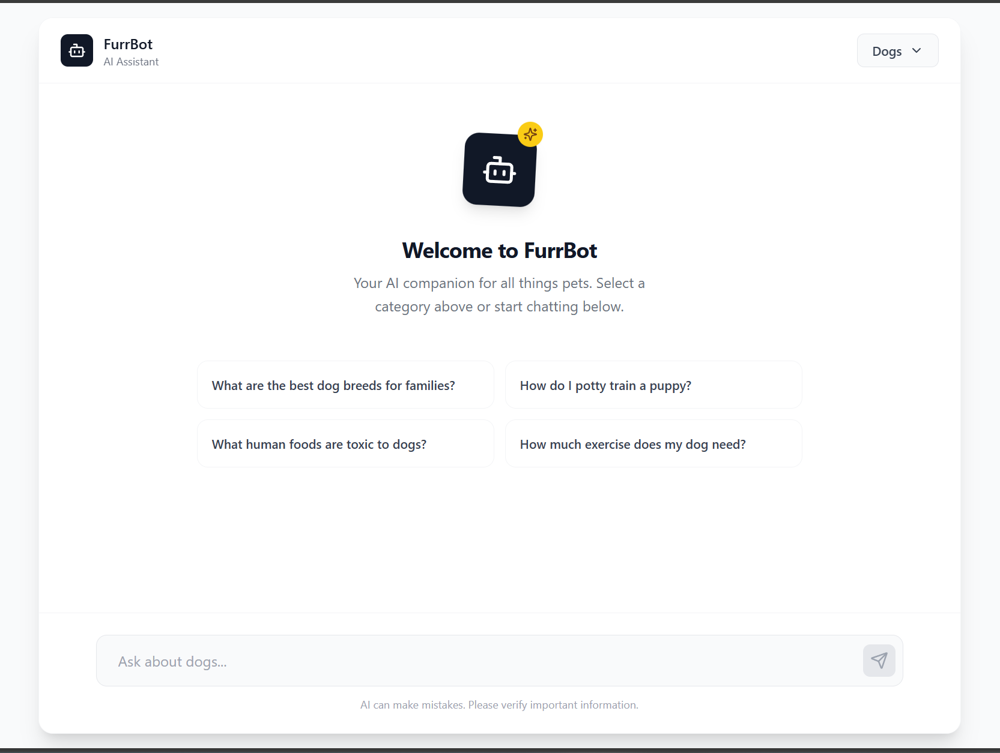
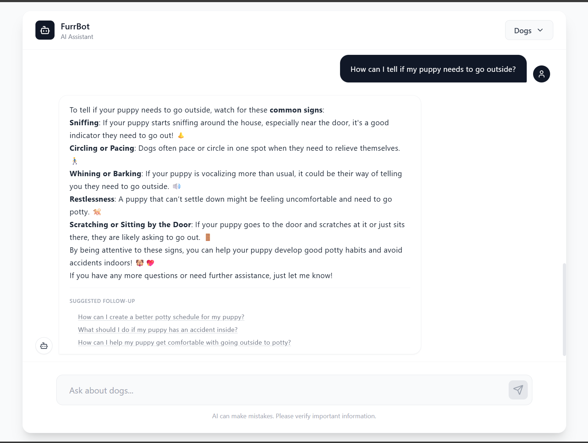

# FurrBot 🐾

**FurrBot** is a modern, RAG-based AI Chatbot designed to assist pet owners and veterinarians with verified and reliable information. Unlike generic chatbots, FurrBot sources its knowledge from a curated database of pet health blogs and docs, ensuring accurate and context-aware responses.

The application has been re-architected into a robust **Headless** system with a **FastAPI** backend and a sleek **React** frontend. It leverages **Pinecone** for vector storage and supports multiple LLM providers (OpenAI, Google Gemini, Anthropic Claude, Mistral).

<div style="display:flex; gap:10px;">
  
  
</div>


## 📌 Core Features  
- Chat about anything related to your pet, being it health, diet, training, grooming, etc.
- More than 18 animal categories (detailed list in raw-data-info.md)
- 200+ Dog breeds, 60+ Cat breeds, 100+ horse breeds, etc
- Prompt tuning to improve answers and context aware conversation

---

## 🛠️ Architecture

The project is split into two main components:

1.  **Backend (`/`)**: Python/FastAPI application that handles RAG logic, database querying, and LLM interaction.
2.  **Frontend (`/frontend`)**: React application that provides the user interface.
3.  **src/steps**: The complete reusable data preparation and processing pipeline.
---

## 💻 Installation & Setup

### Prerequisites
*   Python 3.10+
*   Node.js & npm
*   Git

### 1. Backend Setup

1.  **Clone the repository**:
    ```bash
    git clone https://github.com/ananya868/FurrBot-AI.git
    cd FurrBot-AI
    ```

2.  **Create and Activate Virtual Environment**:
    ```bash
    python -m venv venv
    # Windows
    .\venv\Scripts\activate
    # Mac/Linux
    source venv/bin/activate
    ```

3.  **Install Dependencies**:
    ```bash
    pip install -r requirements.txt
    ```

4.  **Configure Environment Variables**:
    Create a `.env` file in the root directory and add your API keys:
    ```env
    # LLM Providers (Add at least one)
    OPENAI_API_KEY="sk-..."
    GOOGLE_API_KEY="AIza..."
    ANTHROPIC_API_KEY="sk-ant..."
    MISTRAL_API_KEY="..."

    # Vector Database
    PINECONE_API_KEY="pc-..."
    PINECONE_INDEX_HOST="https://your-index-host.pinecone.io"
    ```

5.  **Run the Backend**:
    ```bash
    uvicorn app:app --reload
    ```
    The API will be available at `http://localhost:8000`.  
    You can view the API documentation at `http://localhost:8000/docs`.

### 2. Frontend Setup

1.  **Navigate to Frontend Directory**:
    ```bash
    cd frontend
    ```

2.  **Install Dependencies**:
    ```bash
    npm install
    ```

3.  **Start the Development Server**:
    ```bash
    npm start
    ```
    The application will run at `http://localhost:3000`.

---

## 🔗 API Endpoints

### `POST /ask`
Chat with the bot.

**Request Body:**
```json
{
  "question": "What specifically should I feed my sick Bearded Dragon?",
  "namespace": "reptiles",
  "llm_provider": "openai",
  "llm_model": "gpt-4o",
  "previous_conversation": []
}
```

**Response:**
```json
{
  "answer": "You should feed...",
  "followup": ["Should I keep the temperature higher?", "What about hydration?"]
}
```

### `GET /health`
Check system status (DB connection, active LLM instances, memory usage).

---

## 📂 Project Structure

```text
FurrBot/
├── app.py                 # FastAPI Application Config & Endpoints
├── requirements.txt       # Python Dependencies
├── .env                   # Environment Variables
├── RAG/                   # Core RAG Logic
│   ├── db.py              # Pinecone DB Interface
│   ├── llms.py            # LLM Wrapper Classes (OpenAI, Google, etc)
│   └── prompts.py         # Prompt Templates
├── frontend/              # React Frontend Application
│   ├── public/
│   ├── src/
│   ├── package.json
│   └── tailwind.config.js
└── src/                   # Data Ingestion Pipelines (Offline processing)
```

## 🤝 Contribution

Contributions are welcome! Please feel free to submit a Pull Request.

1.  **Fork the Project**
2.  **Create your Feature Branch** (`git checkout -b feature/AmazingFeature`)
3.  **Commit your Changes** (`git commit -m 'Add some AmazingFeature'`)
4.  **Push to the Branch** (`git push origin feature/AmazingFeature`)
5.  **Open a Pull Request**

## 📬 Contact

For collaborations or queries:
*   **Email**: ananya8154@gmail.com
*   **LinkedIn**: [Ananya](https://www.linkedin.com/in/ananya8154/)
